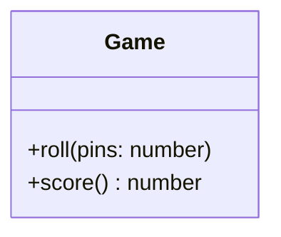
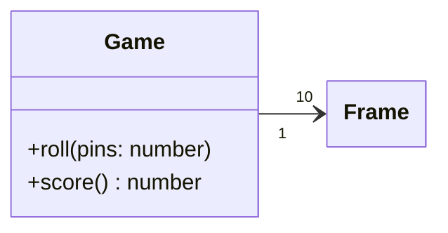
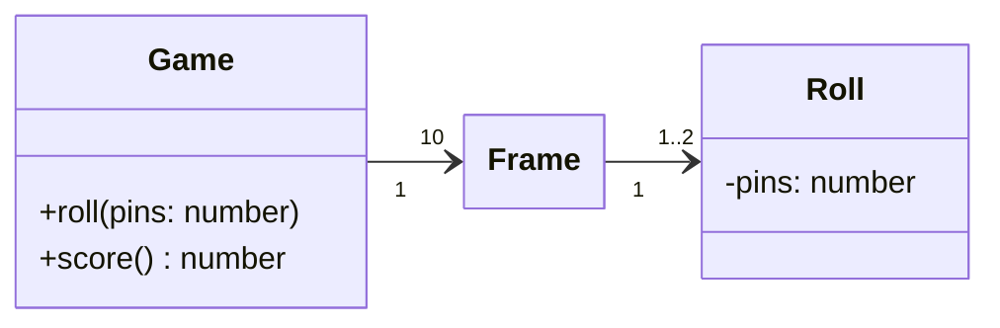
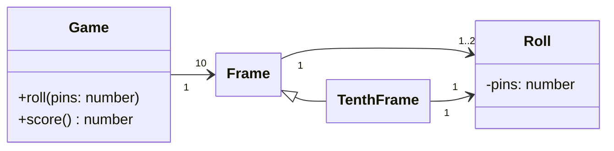
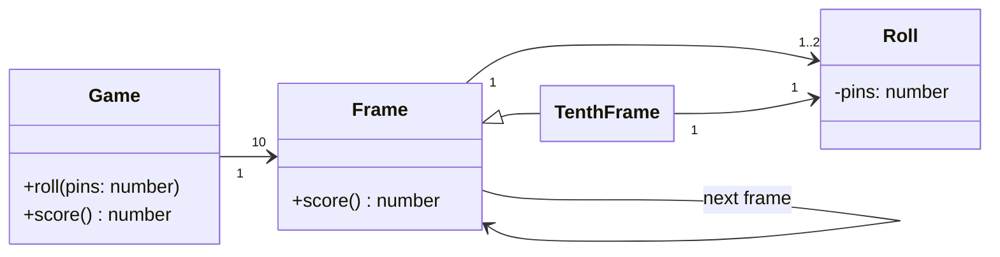

<!--
The game consists of 10 frames as shown above.  In each frame the player has
two opportunities to knock down 10 pins.  The score for the frame is the total
number of pins knocked down, plus bonuses for strikes and spares.

A spare is when the player knocks down all 10 pins in two tries.  The bonus for
that frame is the number of pins knocked down by the next roll.  So in frame 3
above, the score is 10 (the total number knocked down) plus a bonus of 5 (the
number of pins knocked down on the next roll.)

A strike is when the player knocks down all 10 pins on his first try.  The bonus
for that frame is the value of the next two balls rolled.

In the tenth frame a player who rolls a spare or strike is allowed to roll the extra
balls to complete the frame.  However no more than three balls can be rolled in
tenth frame.
-->

---
title: 'Requirements'
---

## Requirements

Write a class named `Game` that has two methods
`roll(pins: number)` is called each time the player rolls a ball. The argument is the number of pins knocked down.  
`score(): number` is called only at the very end of the game.  It returns the total score for that game.

---
layout: center
---

<v-switch text-center>
<template #0>

Clearly, we need the `Game` class.
</template>

<template #1>

A game has 10 frames.
</template>

<template #2>

A frame has 1 or two rolls.

</template>
<template #3>

The score function must iterate through all the frames, and calculate all their scores.
</template>

<template #4>

The score for a spare or a strike depends on the frame’s successor
</template>
</v-switch>