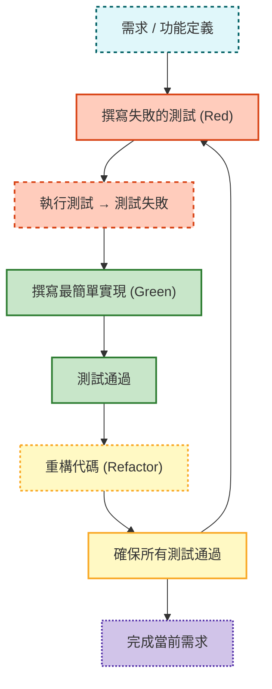

```mermaid {theme: 'neutral', scale: 0.8}
  flowchart TD
      A["需求 / 功能定義"]
      B["撰寫失敗的測試 (Red)"]
      C["執行測試 → 測試失敗"]
      D["撰寫最簡單實現 (Green)"]
      E["測試通過"]
      F["重構代碼 (Refactor)"]
      G["確保所有測試通過"]
      H["完成當前需求"]

      A --> B
      B --> C
      C --> D
      D --> E
      E --> F
      F --> G
      G --> H
      %% 循環箭頭：完成當前需求後，返回需求定義
      G --> B

      %% 自訂樣式設定
      %% 節點 A：需求/功能定義
      style A fill:#e0f7fa,stroke:#006064,stroke-width:2px,stroke-dasharray: 4,2

      %% 節點 B 與 C：測試失敗 (Red) 部分，使用較暖色調
      style B fill:#ffccbc,stroke:#d84315,stroke-width:2px
      style C fill:#ffccbc,stroke:#d84315,stroke-width:2px,stroke-dasharray: 5,5

      %% 節點 D 與 E：實現 & 測試通過 (Green) 部分
      style D fill:#c8e6c9,stroke:#2e7d32,stroke-width:2px
      style E fill:#c8e6c9,stroke:#2e7d32,stroke-width:2px

      %% 節點 F 與 G：重構 (Refactor) 部分，使用醒目的顏色強調
      style F fill:#fff9c4,stroke:#f9a825,stroke-width:2px,stroke-dasharray: 3,3
      style G fill:#fff9c4,stroke:#f9a825,stroke-width:2px

      %% 節點 H：完成需求
      style H fill:#d1c4e9,stroke:#512da8,stroke-width:2px,stroke-dasharray: 2,2
```
